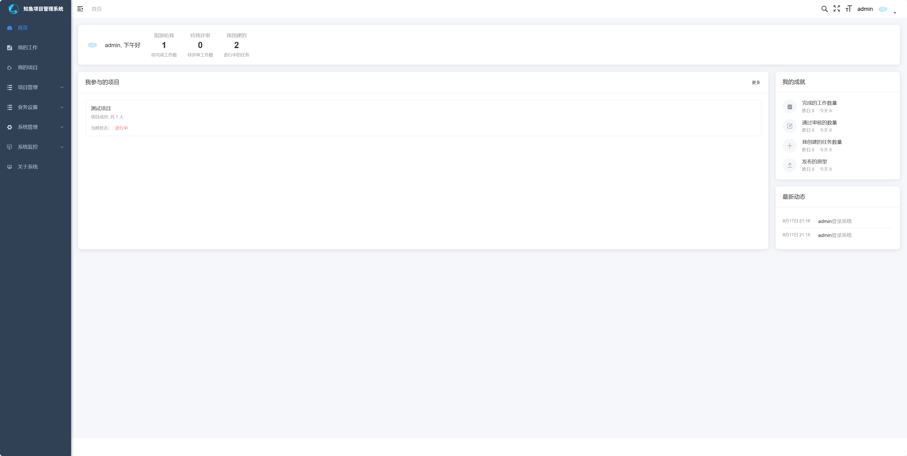
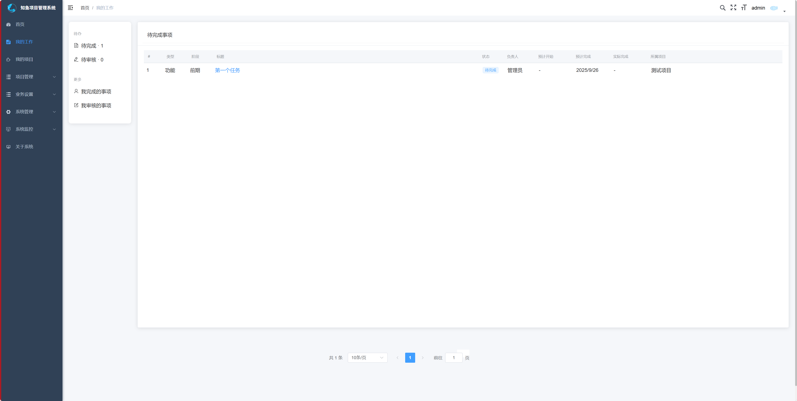
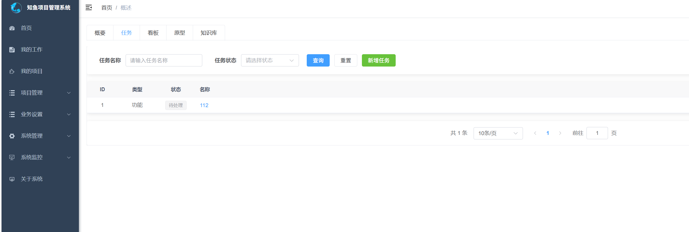
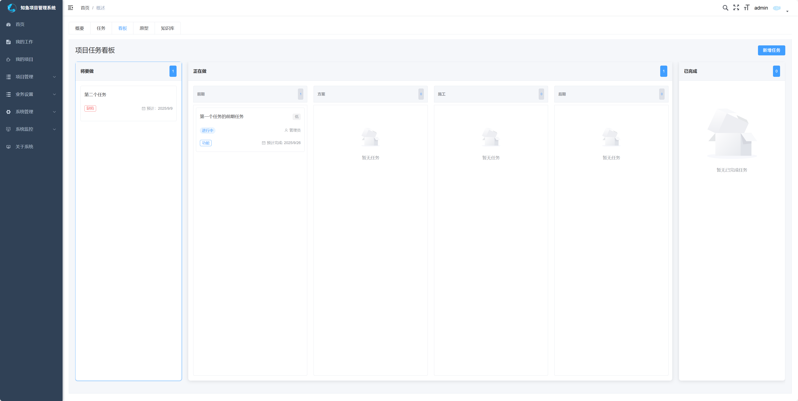
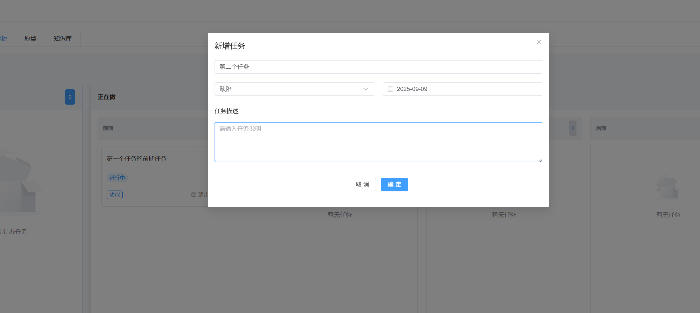
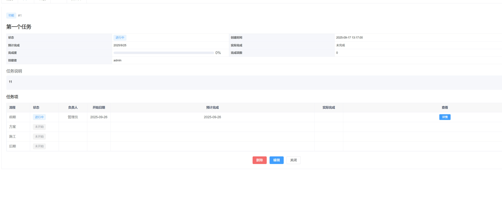
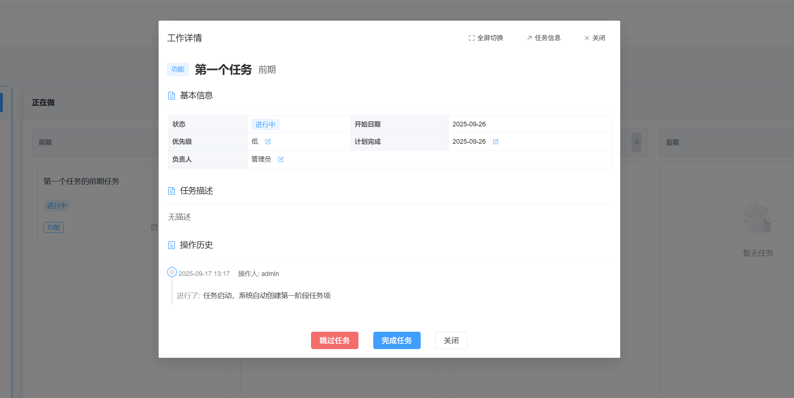
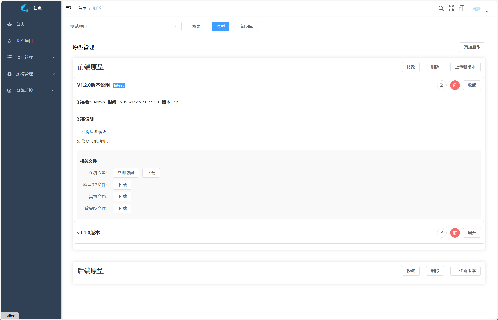

## 介绍

知鱼项目管理系统，简称知鱼PMS，是一款轻量级的项目管理平台，致力于为个人及企业提供高效、便捷的项目管理服务。

功能更模块包括：

- 任务管理

  支持将项目拆解为多阶段任务，自动生成任务进度

- 看板管理

  带有流程的看板，按任务的阶段展示任务的进度

- 甘特图

  展示项目任务的时间进度，帮助团队成员了解任务的完成情况和时间分配。

- 原型管理

  托管 HTML 文件，在线浏览原型

- 知识库管理

  方便进行项目信息和内容分享。

- 项目管理

管理项目和项目成员，控制项目的可见范围

## 软件架构

本项目基于前后端分离架构：
服务端： springboot、mybatis、mysql、redis

前端： vue3、element-plus

## 版本说明

当前版本 V1.5.0

- **V1**
  - [x] v1.5.0 优化看板和任务模式
  - [x] v1.4.0 增加甘特图模块
  - [x] v1.3.0 增加项目看板模块
  - [x] v1.2.0 增加项目任务模块
  - [x] v1.1.0 增加知识库模块
  - [x] v1.0.0 系统正式发布，包含项目管理、原型等功能。

## 版本计划

    * [x] 支持任务甘特图
    * [x] 我创建的任务
    * [x] 连续创建任务
    * [ ] 批量创建任务
    * [ ] 增加消息提醒
    * [ ] 项目周报、日报
    * [ ] 每个项目可自定义阶段
    * [ ] 项目周期管理
    * [ ] 事项的事项

## 功能说明

### 首页

### 我的任务

### 项目管理

1. 创建一个项目，并增加对应人员

   

### 开始使用

1. 从我的项目中 进入项目详情。

   

### 项目任务

### 项目看板

### 甘特图

### 原型功能

0. 进入原型模块

   

1. 进入项目详情，新增一个原型，例如前端原型

   

2. 新增一个发布，并上传已经生成好的 html 文件压缩包（推荐使用 axure）

   

3. 点击立即访问，即可访问原型

   

4. 对方直接打开，即可查看原型文件。

   

5. 当有后续版本更新时，该链接依旧保持不变，客户可随时刷新查看最新的原型列表。

### 知识库功能

0. 进入知识库模块

1. 创建一个目录

2. 创建文章

3. 查看文章

## 测试环境

http://43.143.183.160:10808/

账号请联系：wangluxiaoqi

## 下载获取

方法1. 进去官方网站， [知鱼项目管理系统](https://www.zhiyupm.com/)下载栏目，下载最新版本。

方法2. 加入官方QQ群：7834330，群文件下载。

## 部署方式

### 1. 传统部署方式

1. 准备 mysql、redis 等环境。

2. 下载 deploy 文件夹，找到 windows 目录

3. 创建数据库导入相关文件，并配置相关环境按照目录下的 readme 进行操作）

4. 运行目录下 server.exe

5. 系统即开始运行

6. 登录使用

linux 下部署请参考 [linux 下部署](https://www.zhiyupm.com/wiki/single)

### 2. docker 方式部署（全平台）

推荐使用 compose 方式，该脚本已经打包好 mysql、redis、nginx 以及后端程序

1. 下载 deploy 文件夹，找到 compose 目录

2. 进入 compose 目录

3. 为 app 下 wait-for-it.sh 增加执行权限
   chmod +x wait-for-it.sh

4. 运行 docker compose up (或者 docker compose up -d)

5. 系统即开始运行

6. 登录使用

部署请参考 [docker 部署](https://www.zhiyupm.com/wiki/docker)

默认用户 admin /12345678

其他问题请参考 [常见问题](https://www.zhiyupm.com/wiki)

## 联系交流

交流 QQ 群: 7834330。
微信群，请加 sprapta 拉群 （请加备注，知鱼项目管理系统）

更多信息请查看 [官网](https://www.zhiyupm.com)

## 感谢

感谢 ruoyi-vue-admin、ele-admin-ui、 ruoyi.net 等。
