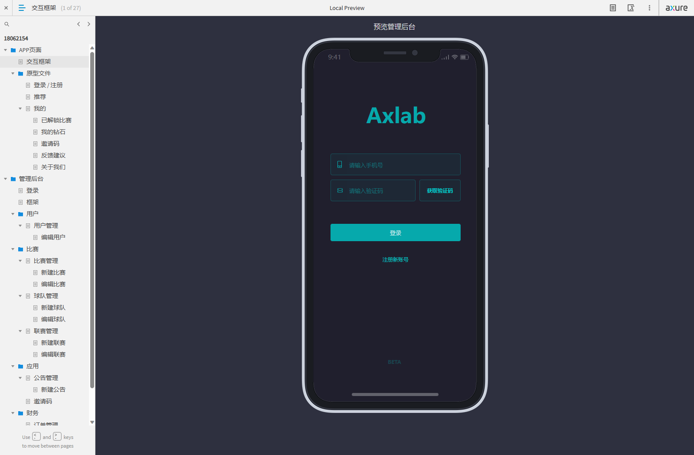

## 介绍

知鱼项目管理系统，个人及企业免费使用。

- 原型管理： 管理产品原型和分享
- 知识库管理： 项目信息和内容分享

## 软件架构

本项目基于前后端分离架构：
服务端：.net core 8
前端端： vue3、elementui

| 目录 | 说明 |
| ---- | ---- |

| deploy | 部署相关工具 |

## 使用说明

###  项目管理
1. 创建一个项目，并增加对应人员

   
   

### 开始使用

1. 从我的项目中 进入项目详情。

   
   

### 原型功能
0. 进入原型模块

   

1. 进入项目详情，新增一个原型，例如前端原型

   

2. 新增一个发布，并上传已经生成好的 html 文件压缩包（推荐使用 axure）

   

3. 点击立即访问，即可访问原型

   

4. 对方直接打开，即可查看原型文件。

   

5. 当有后续版本更新时，该链接依旧保持不变，客户可随时刷新查看最新的原型列表。

### 知识库功能

0. 进入知识库模块

   
1. 创建一个目录

	

 
2. 创建文章

 
3. 查看文章

 

##  下载获取
1. 克隆本仓库，使用depoy文件夹的文件。

2.  使用release 下载最新版本。

3.  进去官方网站，   [知鱼项目管理系统](https://www.zhiyupm.com/)下载栏目，下载最新版本。

## 部署方式

### 1. 单独部署

1. 准备 mysql、redis 等环境。

2. 下载 deploy 文件夹，找到 windows 目录

3. 创建数据库导入相关文件，并配置相关环境按照目录下的 readme 进行操作）

4. 运行目录下 server.exe

5. 系统即开始运行

6. 登录使用

linux下部署请参考     [linux下部署](https://www.zhiyupm.com/wiki/single)

### 2. docker 方式部署（全平台）

推荐使用 compose 方式，该脚本已经打包好 mysql、redis、nginx 以及后端程序

1. 下载 deploy 文件夹，找到 compose 目录

2. 进入 compose 目录

3. 为 app 下 wait-for-it.sh 增加执行权限
   chmod +x wait-for-it.sh

4. 运行 docker compose up (或者 docker compose up -d)

5. 系统即开始运行

6. 登录使用

部署请参考      [docker部署](https://www.zhiyupm.com/wiki/docker)

默认用户 admin /12345678

其他问题请参考    [常见问题](https://www.zhiyupm.com/wiki)

## 其他说明

后续版本规划，交流咨询请加 QQ 群:7834330。

更多信息请查看 [官网](https://www.zhiyupm.com)
## 感谢

感谢 ruoyi-vue-admin、ele-admin-ui、 ruoyi.net 等。
